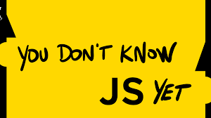

  

## 💡 소개

You Don't Know JS Yet 을 읽고 공부하는 스터디입니다.

 

## 👪 멤버 소개

|  |  |  |  |  |  |
| :------------------------------------------------------------: | :-----------------------------------------------------------: | :-----------------------------------------------------------: | :-----------------------------------------------------------: | :----------------------------------------------------------------: | :------------------------------------------------------------: |
|             [**포코**](https://github.com/poco111)             |          [**아켄**](https://github.com/aken-you)           |            [**릴리**](https://github.com/ahnlook)             |           [**훈딩**](https://github.com/hoongding)            |           [**워터**](https://github.com/yesolyo)           |            [**나니**](https://github.com/bread1022)            |

 
 

> ## **NOTICE**

1. 리뷰 시간 : 매주 화요일 22시.
2. 스터디 예상 소요 시간 : 약 1시간 ~ 1시간 30분
3. 스터디 진행 방식 : 각자 읽고 공부한 내용을 이슈에 올리고 토론하는 방식으로 진행합니다.

 
 

> ## 💡 스터디 내용에서 무슨 이야기를 하면 좋을까요 ?

그날 공부하는 챕터에 대한 내용이라면 어떤 것이라도 좋습니다
다만 서로 이야기 할 때 책 내용을 읽지 않으면 토론이 진행되기 어렵기 때문에
가볍게 **해당 장의 내용을 쭉 읽고 궁금한 점, 이해하기 어려웠던 부분에 대해 공유하고 토론하는 스터디**가 됐으면 합니다

>